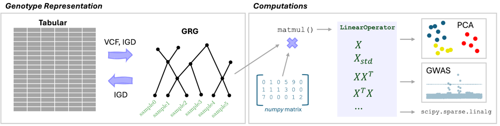

[](http://bioconda.github.io/recipes/pygrgl/README.html)

# Genotype Representation Graphs

A Genotype Representation Graph (GRG) is a compact way to store reference-aligned genotype data for large
genetic datasets. Computations with GRG can either be performed in a "graph native" way ([DFS](https://grgl.readthedocs.io/en/stable/python_api.html#pygrgl.get_dfs_order),
[BFS](https://grgl.readthedocs.io/en/stable/python_api.html#pygrgl.get_bfs_order), or [topological order](https://grgl.readthedocs.io/en/stable/python_api.html#pygrgl.get_topo_order) 
traversals) or using [matrix multiplication](https://grgl.readthedocs.io/en/stable/python_api.html#pygrgl.matmul), which also supports the 
standardized matrix and GRM through [LinearOperators](https://grgl.readthedocs.io/en/stable/tutorials/LinearOperators.html).

A GRG can be constructed from [.vcf.gz](https://grgl.readthedocs.io/en/stable/tutorials/VCFToGRG.html), [IGD](https://grgl.readthedocs.io/en/stable/tutorials/IGDToGRG.html),
[tskit tree-sequence ARGs](https://grgl.readthedocs.io/en/stable/tutorials/WorkingWithSimData.html), or through
Python APIs for [node](https://grgl.readthedocs.io/en/stable/python_api.html#pygrgl.MutableGRG.make_node) and 
[edge](https://grgl.readthedocs.io/en/stable/python_api.html#pygrgl.MutableGRG.connect) creation.

A GRG contains Mutation nodes (representing variants) and Sample nodes (representing haploid samples), where there is a path from
a Mutation node to a Sample node if-and-only-if that sample contains that mutation. These paths go through internal nodes that represent
common ancestry between multiple samples, and this can result in significant compression **(25-50x smaller than
.vcf.gz)**. Calculations on the whole dataset can be performed very quickly on GRG, using GRGL. 

If you use GRG in your research, please cite the [initial paper](https://www.nature.com/articles/s43588-024-00739-9):

> DeHaas, Drew, Ziqing Pan, and Xinzhu Wei. "Enabling efficient analysis of biobank-scale data with genotype representation graphs." Nature computational science 5, no. 2 (2025): 112-124.

If you use [grapp](https://github.com/aprilweilab/grapp) for PCA, GWAS, LinearOperators, etc., you can cite the
[recent preprint](https://doi.org/10.64898/2026.04.10.717786):

> DeHaas, Drew, Chris Adonizio, Ziqing Pan, and Xinzhu Wei. "General, orders-of-magnitude faster whole-genome analysis with genotype representation graphs." bioRxiv (2026).

This preprint also describes improvements in GRGL v2.5: graphs are smaller, faster to construct, and faster for computation.

* Unlike other graph-based methods (e.g., ARG inference), GRG can be constructed very quickly from tabular datasets, similar to the cost of creating a PLINK2 PGEN file.
* There is experimental support for unphased data, but it does not compress nearly as well as phased data.
* Construction from `.vcf.gz` now supports tabix indexes, making that input format feasible for large datasets
* Missing data is supported, see [the documentation](https://grgl.readthedocs.io/en/stable/)

<a href="https://github.com/aprilweilab/grgl/blob/main/readme.fig.png"></a>


# Documentation

Check out [the main documentation](https://grgl.readthedocs.io/en/latest/) for core API documentation, examples, tutorials, etc. Things covered in the documentation include:
* Creating and using GRGs
* Performing GWAS, PCA, GWAS with covariates, or other analyses with GRG via [grapp](https://github.com/aprilweilab/grapp) (`pip install grapp`)
  * See also the [grapp API reference](https://grapp.readthedocs.io/en/latest/)
* Simulating phenotypes with GRG via [grg_pheno_sim](https://github.com/aprilweilab/grg_pheno_sim/) (`pip install grg_pheno_sim` -- see [the paper](https://doi.org/10.1093/bioadv/vbag040))
* Using GRG with Python (integration with [numpy](https://numpy.org/), [pandas](https://pandas.pydata.org/), [scipy](https://scipy.org/), etc.)

You can also download the tutorials as [Jupyter Notebooks](https://github.com/aprilweilab/grgl/tree/main/doc/tutorials/notebooks) and work through them interactively.

# Genotype Representation Graph Library (GRGL)

GRGL can be used as a library in both C++ and Python. Support is currently limited to Linux and MacOS.
It contains both an API [(see docs)](https://grgl.readthedocs.io/) and a [set of command-line tools](https://github.com/aprilweilab/grgl/blob/main/GettingStarted.md).

## Installing from pip

If you just want to use the tools (e.g., constructing GRG or converting tree-sequence to GRG) and the Python API then you can install via pip (from [PyPi](http://pypi.org/project/pygrgl/)).

```
pip install pygrgl
```

This will use prebuilt packages for most modern Linux situations, and will build from source for MacOS. In order to build from source it will require CMake (at least v3.14), zlib development headers, and a clang or GCC compiler that supports C++11.

## Installing from conda

You can also install the [conda package](https://bioconda.github.io/recipes/pygrgl/README.html) via the [bioconda](https://bioconda.github.io/) channel: `conda install pygrgl`.

## Building (Python)

The Python installation installs the command line tools and Python libraries (the C++ executables are packaged as part of this). Make sure you clone with `git clone --recursive`!

Requires Python 3.7 or newer to be installed (including development headers). It is recommended that you build/install in a virtual environment.
```
python3 -m venv /path/to/MyEnv
source /path/to/MyEnv/bin/activate
python setup.py bdist_wheel               # Compiles C++, builds a wheel in the dist/ directory
pip install --force-reinstall dist/*.whl  # Install from wheel
```

Build and installation should take at most a few minutes on the typical computer. For more details on build options, see [DEVELOPING.md](https://github.com/aprilweilab/grgl/blob/main/DEVELOPING.md).

## Building (C++ only)

The C++ build is only necessary for folks who want to include GRGL as a library in their C++ project. Typically, you would include our
CMake into your project via [add\_subdirectory](https://cmake.org/cmake/help/latest/command/add_subdirectory.html), but you can also build
standalone as below. Make sure you clone with `git clone --recursive`!

If you only intend to use GRGL from C++, you can just build it via `CMake`:
```
mkdir build && cd build
cmake .. -DCMAKE_BUILD_TYPE=Release
make -j4
```

See below to install the libraries to your system. It is recommended to install it to a custom location (prefix) since removing packages installed via `make install` is a pain otherwise. Example:
```
mkdir /path/to/grgl_installation/
mkdir build && cd build
cmake .. -DCMAKE_BUILD_TYPE=Release -DCMAKE_INSTALL_PREFIX=/path/to/grgl_installation/
make -j4
make install
# There should now be bin/, lib/, etc., directories under /path/to/grgl_installation/
```

## Building (Docker)

We've included a Dockerfile if you want to use GRGL in a container.

Example to build:
```
docker build . -t grgl:latest
```

Example to run, constructing a GRG from an example VCF file:
```
docker run -v $PWD:/working -it grgl:latest bash -c "cd /working && grg construct --force /working/test/inputs/msprime.example.vcf"
```

## Usage (Command line)

There is a command line tool that is mostly for file format conversion and performing common computations on the GRG. For more flexibility, use the Python or C++ APIs.
After building and installing the Python version, run `grg --help` to see all the command options. Some examples are below.

Convert a [tskit](https://tskit.dev/software/tskit.html) tree-sequence into a GRG. This creates `my_arg_data.grg` from `my_arg_data.trees`:
```
grg convert /path/to/my_arg_data.trees my_arg_data.grg
```

Load a GRG and emit some simple statistics about the GRG itself:
```
grg process stats my_arg_data.grg
```

You can also use [grapp](https://github.com/aprilweilab/grapp) to see the same stats:
```
grapp show -i my_arg_data.grg
```

To construct a GRG from a VCF file, use the `grg construct` command. (**NOTE** raw VCF is incredibly slow for non-trivial datasets, use BGZF indexed with tabix or IGD):
```
grg construct -j 1 path/to/foo.vcf.gz
```

To convert a VCF(.gz) to an IGD and then build a GRG:
```
pip install igdtools
igdtools path/to/foo.vcf -o foo.igd
grg construct -j 1 foo.igd
```

Increase `-j` to the number of threads you have. `igdtools` can also use more threads if the VCF is BGZF and tabix indexed.
Construction for small datasets (such as those included as tests in this repository) should be very fast, on the order of seconds. Really large datasets (such as Biobank-scale whole genome sequences) can take on the order of hours when using lots of threads (e.g., 70). 1,000 Genomes Project chromosomes usually take on the order of a few minutes.

## Usage (Python API)

See the provided [jupyter notebooks](https://github.com/aprilweilab/grgl/tree/main/jupyter) and [GettingStarted.md](https://github.com/aprilweilab/grgl/blob/main/GettingStarted.md) for more examples.


## Limits

| Quantity | Limit |
| -------- | ----- |
| Haploid samples | 2,147,483,646 |
| Total nodes | 2,147,483,646 |
| Total mutations (variants) | 4,294,967,294 |
| Total edges | 18,446,744,073,709,551,615 |
| Edges to/from a single node | 4,294,967,295 |

_Note_: Node limits can theoretically be expanded to about a trillion, by turning on the `LARGE_NODE_IDS` preprocessor flag, but this mode is not well tested.
