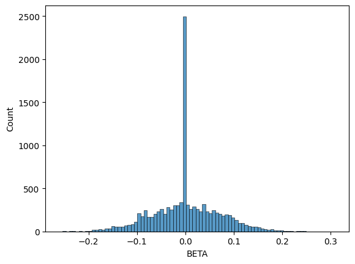
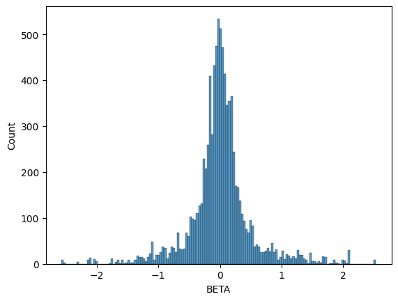

GWAS Tutorial
=============

This tutorial describes how to perform a GWAS with simple linear
regression, where each SNP is treated independently when determining its
effect on the phenotype. Lets consider our input data to be a genotype
matrix :math:`X` which has :math:`N` rows (number of individuals) and
:math:`M` columns (number of variants, usually SNPs). We’re using
`Genotype Representation
Graphs <https://grgl.readthedocs.io/en/stable/concepts.html#grg>`__ to
represent our genotype matrix. If you have ``.vcf.gz`` data, see
`Converting .vcf.gz to GRG <VCFToGRG.html>`__. If you have (or want) a
more efficicient representation than ``.vcf.gz`` see `Converting IGD to
GRG <IGDToGRG.html>`__.

For this tutorial, we’ll just use a (really) small simulated dataset of
200 individuals that we can quickly download. Replace it with your own
dataset as desired.

The other piece of information we need for performing a GWAS is the
phenotype, :math:`Y`. We are just going to simulate a phenotype for this
tutorial, but replace it with your own phenotype as desired.

**What you’ll need:**

-  Python dependencies “grapp”, “igdtools”, “seaborn”:
   ``pip install grapp igdtools seaborn``
-  Command line tool “wget”: ``sudo apt install wget`` (or your system’s
   equivalent)

Get Dataset
~~~~~~~~~~~

.. code:: bash

    %%bash
    
    if [[ ! -e gwas.example.igd ]]; then
      # Download a small example dataset
      wget https://github.com/aprilweilab/grg_pheno_sim/raw/refs/heads/main/demos/data/test-200-samples.vcf.gz -O gwas.example.vcf.gz
    
      # Convert to IGD; this isn't necessary, but most of the time you will want to do this
      igdtools gwas.example.vcf.gz -o gwas.example.igd
    fi
    
    # Just show some stats about the dataset
    igdtools -s gwas.example.igd

.. parsed-literal::

    --2026-02-06 12:38:49--  https://github.com/aprilweilab/grg_pheno_sim/raw/refs/heads/main/demos/data/test-200-samples.vcf.gz
    Resolving github.com (github.com)... 140.82.113.4
    Connecting to github.com (github.com)|140.82.113.4|:443... connected.
    HTTP request sent, awaiting response... 302 Found
    Location: https://raw.githubusercontent.com/aprilweilab/grg_pheno_sim/refs/heads/main/demos/data/test-200-samples.vcf.gz [following]
    --2026-02-06 12:38:49--  https://raw.githubusercontent.com/aprilweilab/grg_pheno_sim/refs/heads/main/demos/data/test-200-samples.vcf.gz
    Resolving raw.githubusercontent.com (raw.githubusercontent.com)... 185.199.108.133, 185.199.111.133, 185.199.110.133, ...
    Connecting to raw.githubusercontent.com (raw.githubusercontent.com)|185.199.108.133|:443... connected.
    HTTP request sent, awaiting response... 200 OK
    Length: 494022 (482K) [application/octet-stream]
    Saving to: ‘gwas.example.vcf.gz’
    
         0K .......... .......... .......... .......... .......... 10% 1.99M 0s
        50K .......... .......... .......... .......... .......... 20% 3.93M 0s
       100K .......... .......... .......... .......... .......... 31% 4.50M 0s
       150K .......... .......... .......... .......... .......... 41% 4.25M 0s
       200K .......... .......... .......... .......... .......... 51% 4.32M 0s
       250K .......... .......... .......... .......... .......... 62% 4.14M 0s
       300K .......... .......... .......... .......... .......... 72% 4.18M 0s
       350K .......... .......... .......... .......... .......... 82% 4.39M 0s
       400K .......... .......... .......... .......... .......... 93% 3.06M 0s
       450K .......... .......... .......... ..                   100% 5.78M=0.1s
    
    2026-02-06 12:38:49 (3.72 MB/s) - ‘gwas.example.vcf.gz’ saved [494022/494022]
    

.. parsed-literal::

    Wrote 10893 total variants
    Of which 6228 were written sparsely
    Stats for gwas.example.igd
    ... in range 0 - 18446744073709551615
      Variants in range: 10893
      Average samples/var: 50.2075
      Stddev samples/var: 86.1985
      Average var/sample: 1367.28
      Stddev var/sample: 25.9211
      Variants with missing data: 0
      Total missing alleles: 0
      Total unique sites: 10885

Convert to GRG
--------------

.. code:: bash

    %%bash
    
    if [[ ! -e gwas.example.grg ]]; then
      # -j controls how many threads to use.
      grg construct -j 1 gwas.example.igd -o gwas.example.grg
    fi

.. parsed-literal::

    Processing input file in 85 parts.
    Auto-calculating number of trees per part.
    Converting segments of input data to graphs
    100%|██████████| 85/85 [00:00<00:00, 159.81it/s]
    Merging...

.. parsed-literal::

    === GRG Statistics ===
    Nodes: 15481
    Edges: 93351
    Samples: 400
    Mutations: 10893
    Ploidy: 2
    Phased: true
    Populations: 0
    Range of mutations: 55829 - 9999127
    Specified range: 0 - 10894
    ======================
    Wrote simplified GRG with:
      Nodes: 15481
      Edges: 93351
    Wrote GRG to gwas.example.grg

Simulate Phenotype
------------------

Since this phenotype is just for demonstration purposes, we can use the
default settings for phenotype simulation. See `Simulating
Phenotypes <SimulatingPhenotypes.html>`__ for a more detailed tutorial
that describes the range of options. Here, we just want a phenotype that
has been derived from the genotype: that is, our simulation will choose
some “causal mutations” that are responsible for some proportion of the
phenotype (this is called the heritability), and compute for each
individual a phenotype value from the actual mutations the individual
has.

By default, phenotype simulation draws effect sizes for causal SNPs from
a standard normal distribution ~\ :math:`N(0, 1)`.

.. code:: bash

    %%bash
    
    grapp pheno gwas.example.grg

.. parsed-literal::

    The initial effect sizes are 
           mutation_id  effect_size  causal_mutation_id
    0                0    -1.657757                   0
    1                1    -0.537562                   0
    2                2     1.146189                   0
    3                3    -0.697705                   0
    4                4    -0.157002                   0
    ...            ...          ...                 ...
    10888        10888    -0.217740                   0
    10889        10889     0.936594                   0
    10890        10890     0.976964                   0
    10891        10891     0.274724                   0
    10892        10892     0.711005                   0
    
    [10893 rows x 3 columns]
    The genetic values of the individuals are 
         individual_id  genetic_value  causal_mutation_id
    0                0     -62.758200                   0
    1                1       8.271010                   0
    2                2     -93.726026                   0
    3                3     -58.657459                   0
    4                4     -47.272752                   0
    ..             ...            ...                 ...
    195            195     -22.379358                   0
    196            196      34.579149                   0
    197            197     -40.854451                   0
    198            198     -21.653168                   0
    199            199     -69.561989                   0
    
    [200 rows x 3 columns]
    
    Wrote phenotypes to gwas.example.grg.phen

Perform association between genotype and phenotype
--------------------------------------------------

Now we want to learn the association between the genotype :math:`X` and
the phenotype :math:`Y`. We are using simple linear regression to do
this. The result is a value :math:`\beta_i` for each mutation :math:`i`:
a larger absolute value indicates a larger effect of that mutation
(variant) on the phenotype. We are finding *correlations* between
:math:`X` and :math:`Y`. A variant :math:`i` that is highly correlated
with a phenotype :math:`Y` *might* have a causal relationship to
:math:`Y`.

GWAS via command line
~~~~~~~~~~~~~~~~~~~~~

First we’ll run the shell commands that perform a GWAS.

.. code:: bash

    %%bash
    
    # Using our phenotype file, emit a tab-separated (tsv) pandas dataframe containing the results of our GWAS between X (test-200-samples.grg) and Y (test-200-samples.grg.phen)
    grapp assoc -p gwas.example.grg.phen -o gwas.example.gwas.tsv gwas.example.grg

.. parsed-literal::

    Wrote results to gwas.example.gwas.tsv

Now we can examine the results by loading the dataframe into pandas.

.. code:: ipython3

    import pandas
    
    gwas_df = pandas.read_csv("gwas.example.gwas.tsv", delimiter="\t")
    gwas_df

.. raw:: html

    

    
    <table border="1" class="dataframe">
      <thead>
        <tr style="text-align: right;">
          <th></th>
          <th>POS</th>
          <th>ALT</th>
          <th>COUNT</th>
          <th>BETA</th>
          <th>B0</th>
          <th>SE</th>
          <th>R2</th>
          <th>T</th>
          <th>P</th>
        </tr>
      </thead>
      <tbody>
        <tr>
          <th>0</th>
          <td>55829</td>
          <td>G</td>
          <td>4</td>
          <td>0.549634</td>
          <td>-0.010993</td>
          <td>0.504841</td>
          <td>5.950858e-03</td>
          <td>1.088726</td>
          <td>0.277598</td>
        </tr>
        <tr>
          <th>1</th>
          <td>56812</td>
          <td>T</td>
          <td>3</td>
          <td>0.907215</td>
          <td>-0.013608</td>
          <td>0.579622</td>
          <td>1.222152e-02</td>
          <td>1.565184</td>
          <td>0.119137</td>
        </tr>
        <tr>
          <th>2</th>
          <td>57349</td>
          <td>G</td>
          <td>1</td>
          <td>-0.678575</td>
          <td>0.003393</td>
          <td>1.003880</td>
          <td>2.302321e-03</td>
          <td>-0.675952</td>
          <td>0.499860</td>
        </tr>
        <tr>
          <th>3</th>
          <td>58785</td>
          <td>T</td>
          <td>10</td>
          <td>0.057616</td>
          <td>-0.002881</td>
          <td>0.325235</td>
          <td>1.584750e-04</td>
          <td>0.177153</td>
          <td>0.859570</td>
        </tr>
        <tr>
          <th>4</th>
          <td>59367</td>
          <td>A</td>
          <td>2</td>
          <td>-0.908389</td>
          <td>0.009084</td>
          <td>0.709531</td>
          <td>8.210244e-03</td>
          <td>-1.280268</td>
          <td>0.201949</td>
        </tr>
        <tr>
          <th>...</th>
          <td>...</td>
          <td>...</td>
          <td>...</td>
          <td>...</td>
          <td>...</td>
          <td>...</td>
          <td>...</td>
          <td>...</td>
          <td>...</td>
        </tr>
        <tr>
          <th>10888</th>
          <td>9997601</td>
          <td>G</td>
          <td>3</td>
          <td>-0.167107</td>
          <td>0.002507</td>
          <td>0.583076</td>
          <td>4.146596e-04</td>
          <td>-0.286595</td>
          <td>0.774722</td>
        </tr>
        <tr>
          <th>10889</th>
          <td>9998038</td>
          <td>A</td>
          <td>21</td>
          <td>0.002723</td>
          <td>-0.000286</td>
          <td>0.209978</td>
          <td>8.491021e-07</td>
          <td>0.012966</td>
          <td>0.989668</td>
        </tr>
        <tr>
          <th>10890</th>
          <td>9998412</td>
          <td>G</td>
          <td>42</td>
          <td>0.082101</td>
          <td>-0.017241</td>
          <td>0.164311</td>
          <td>1.259359e-03</td>
          <td>0.499667</td>
          <td>0.617864</td>
        </tr>
        <tr>
          <th>10891</th>
          <td>9999031</td>
          <td>C</td>
          <td>295</td>
          <td>-0.095009</td>
          <td>0.140138</td>
          <td>0.116444</td>
          <td>3.350993e-03</td>
          <td>-0.815921</td>
          <td>0.415526</td>
        </tr>
        <tr>
          <th>10892</th>
          <td>9999126</td>
          <td>T</td>
          <td>2</td>
          <td>0.921135</td>
          <td>-0.009211</td>
          <td>0.709448</td>
          <td>8.442252e-03</td>
          <td>1.298383</td>
          <td>0.195666</td>
        </tr>
      </tbody>
    </table>
    
10893 rows × 9 columns

    

``BETA`` is the effect size for the variant at base-pair position
``POS`` with alternate allele ``ALT``. We can plot the histogram of our
inferred ``BETA`` values and see that it does indeed recover a normal
distribution centered at :math:`0`, which is what we simulated with our
phenotype.

.. code:: ipython3

    import seaborn
    seaborn.histplot(data=gwas_df, x="BETA")

.. parsed-literal::

    <Axes: xlabel='BETA', ylabel='Count'>

GWAS via Python APIs
~~~~~~~~~~~~~~~~~~~~

Now we do the same GWAS, but using Python code instead of running
``grapp assoc ...`` on the command line. This gives us more options. In
this example, we’ll standardize the genotype matrix :math:`X` prior to
performing the linear regression, which will make all mutations
(variants) have the same variance. This has the effect of putting
variants with different allele frequencies on the same scale.

.. code:: ipython3

    from grapp.assoc import linear_assoc_no_covar
    import pygrgl
    
    GRG_FILE = "gwas.example.grg"
    PHEN_FILE = "gwas.example.grg.phen"
    
    # Load the GRG into memory
    grg = pygrgl.load_immutable_grg(GRG_FILE)
    
    # Load the phenotype into memory
    Y = pandas.read_csv(PHEN_FILE, delimiter="\t")
    
    # Perform the GWAS
    gwas_df = linear_assoc_no_covar(grg, Y["phenotypes"].to_numpy(), standardize=True)
    gwas_df

.. raw:: html

    

    
    <table border="1" class="dataframe">
      <thead>
        <tr style="text-align: right;">
          <th></th>
          <th>POS</th>
          <th>ALT</th>
          <th>COUNT</th>
          <th>BETA</th>
          <th>B0</th>
          <th>SE</th>
          <th>R2</th>
          <th>T</th>
          <th>P</th>
        </tr>
      </thead>
      <tbody>
        <tr>
          <th>0</th>
          <td>55829</td>
          <td>G</td>
          <td>4</td>
          <td>0.076559</td>
          <td>-0.001531</td>
          <td>0.070680</td>
          <td>5.893105e-03</td>
          <td>1.083182</td>
          <td>0.280045</td>
        </tr>
        <tr>
          <th>1</th>
          <td>56812</td>
          <td>T</td>
          <td>3</td>
          <td>0.109857</td>
          <td>-0.001648</td>
          <td>0.070458</td>
          <td>1.213189e-02</td>
          <td>1.559188</td>
          <td>0.120549</td>
        </tr>
        <tr>
          <th>2</th>
          <td>57349</td>
          <td>G</td>
          <td>1</td>
          <td>-0.047802</td>
          <td>0.000239</td>
          <td>0.070808</td>
          <td>2.296608e-03</td>
          <td>-0.675103</td>
          <td>0.500398</td>
        </tr>
        <tr>
          <th>3</th>
          <td>58785</td>
          <td>T</td>
          <td>10</td>
          <td>0.012395</td>
          <td>-0.000620</td>
          <td>0.070884</td>
          <td>1.547976e-04</td>
          <td>0.174866</td>
          <td>0.861363</td>
        </tr>
        <tr>
          <th>4</th>
          <td>59367</td>
          <td>A</td>
          <td>2</td>
          <td>-0.090156</td>
          <td>0.000902</td>
          <td>0.070599</td>
          <td>8.169803e-03</td>
          <td>-1.277021</td>
          <td>0.203090</td>
        </tr>
        <tr>
          <th>...</th>
          <td>...</td>
          <td>...</td>
          <td>...</td>
          <td>...</td>
          <td>...</td>
          <td>...</td>
          <td>...</td>
          <td>...</td>
          <td>...</td>
        </tr>
        <tr>
          <th>10888</th>
          <td>9997601</td>
          <td>G</td>
          <td>3</td>
          <td>-0.020235</td>
          <td>0.000304</td>
          <td>0.070874</td>
          <td>4.116188e-04</td>
          <td>-0.285510</td>
          <td>0.775552</td>
        </tr>
        <tr>
          <th>10889</th>
          <td>9998038</td>
          <td>A</td>
          <td>21</td>
          <td>0.000984</td>
          <td>-0.000103</td>
          <td>0.070889</td>
          <td>9.834740e-07</td>
          <td>0.013878</td>
          <td>0.988941</td>
        </tr>
        <tr>
          <th>10890</th>
          <td>9998412</td>
          <td>G</td>
          <td>42</td>
          <td>0.035205</td>
          <td>-0.007393</td>
          <td>0.070843</td>
          <td>1.300555e-03</td>
          <td>0.496945</td>
          <td>0.619779</td>
        </tr>
        <tr>
          <th>10891</th>
          <td>9999031</td>
          <td>C</td>
          <td>295</td>
          <td>-0.056399</td>
          <td>0.083189</td>
          <td>0.070528</td>
          <td>1.015194e-02</td>
          <td>-0.799665</td>
          <td>0.424863</td>
        </tr>
        <tr>
          <th>10892</th>
          <td>9999126</td>
          <td>T</td>
          <td>2</td>
          <td>0.091421</td>
          <td>-0.000914</td>
          <td>0.070591</td>
          <td>8.400669e-03</td>
          <td>1.295089</td>
          <td>0.196797</td>
        </tr>
      </tbody>
    </table>
    
10893 rows × 9 columns

    

We can see that the output format (dataframe) is the same as the command
line version. We should expect some differences in the distribution of
betas because we standardized :math:`X` this time, though the shape
should still be a normal distribution centered at :math:`0`.

.. code:: ipython3

    seaborn.histplot(data=gwas_df, x="BETA")

.. parsed-literal::

    <Axes: xlabel='BETA', ylabel='Count'>

You can see that the range of beta values is much smaller (from
:math:`-0.3` to :math:`+0.3`).

Finally, we can perform one more GWAS where we use an approximate
distribution for the variance of each mutation in :math:`X`. Each value
in the :math:`X` matrix can take on a value of :math:`0`, :math:`1`, or
:math:`2`, based on how many copies each of the (diploid) individuals
has for that allele. By default, the linear regression is performed with
the exact sum of squared errors, based on these diploid values in
:math:`X`. Theoretically, in the absence of many complicating effects
(selection, genotyping error, inbreeding, etc.) the variance of each
mutation should follow a binomial distribution with mean
:math:`2 \times f_i` (where :math:`f_i` is the allele frequency for
mutation :math:`i`). You can choose to perform the regression using the
binomial distribution, instead of the exact values, via
``dist="binomial"``, as shown below.

.. code:: ipython3

    gwas_df = linear_assoc_no_covar(grg, Y["phenotypes"].to_numpy(), dist="binomial")
    seaborn.histplot(data=gwas_df, x="BETA")

.. parsed-literal::

    <Axes: xlabel='BETA', ylabel='Count'>

You can see that this (non-standardized) distribution follows our
original (exact) result pretty closely, even with a small sample size of
200 individuals. Partially this is because our genotype matrix :math:`X`
was generated using a neutral simulation; in real datasets, the binomial
distribution may cause more beta values to differ from the exact value
than is shown here.

Related Topics
--------------

-  In practice, GWAS is often performed while handling covariates (such
   as age, sex, principal components, etc). See `GWAS with
   Covariates <GWASCovariates.html>`__.
-  See `Simulating Phenotypes <SimulatingPhenotypes.html>`__ for a more
   details on generating synthetic phenotypes.
-  Documentation links:

   -  `grapp.assoc <https://grapp.readthedocs.io/en/latest/grapp.html#module-grapp.assoc>`__:
      Python APIs for GWAS
