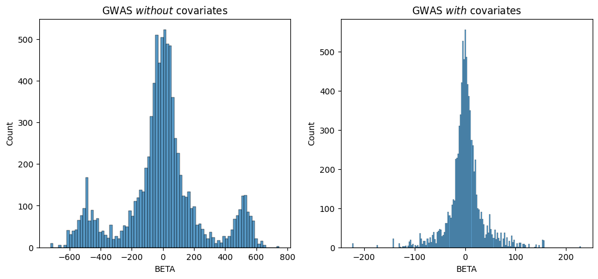
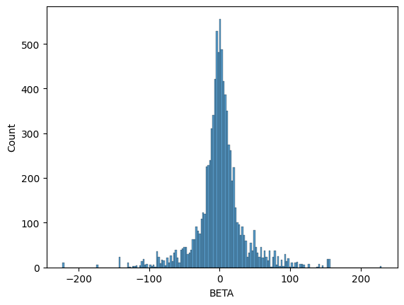

GWAS Tutorial: with covariates
==============================

This tutorial builds on `the simple GWAS tutorial <GWAS.html>`__ and
`the PCA tutorial <PCA.html>`__. Here we show how to perform a GWAS with
covariates. In this case, we use the first 10 principal components as
the covariates, but covariates can be anything relating to the phenotype
:math:`Y`. Again, this is simple linear regression. We’re using
`Genotype Representation
Graphs <https://grgl.readthedocs.io/en/stable/concepts.html#grg>`__ to
represent our genotype matrix. If you’re not sure how to get a GRG,
start with `the simple GWAS tutorial <GWAS.html>`__ instead, since we
are re-using the ``gwas.example.grg`` from that tutorial.

**What you’ll need:** \* Files: ``gwas.example.grg`` \* Python
dependencies “grapp”, “seaborn”: ``pip install grapp igdtools seaborn``

Simulate Phenotype
------------------

Like the simple GWAS tutorial, we are mostly using the default settings
for phenotype simulation, which just draws effect sizes for causal SNPs
from a standard normal distribution ~\ :math:`N(0, 1)`. However, we are
going to add a slight complication: we are going to assume that there is
a binary attribute of individuals that affects the phenotype, but is not
genetic (or at least, is more environmental than genetic). We can do
this by using the `grg_pheno_sim Python
APIs <https://grg-pheno-sim.readthedocs.io/en/latest/grg_pheno_sim.html>`__
and specifying a covariate as input to the simulation.

.. code:: ipython3

    import numpy
    import pygrgl
    
    numpy.random.seed(42)
    
    # Load the GRG dataset
    grg = pygrgl.load_immutable_grg("gwas.example.grg")
    
    # Generate our random (binary) environment attribute that affects Y
    env_attribute = ((numpy.random.uniform(size=(grg.num_individuals, 1)) > 0.5) * 1).astype(numpy.float64)

.. code:: ipython3

    from grg_pheno_sim.phenotype import add_covariates, convert_to_phen
    import pandas
    
    # Now simulate our phenotype, taking into account that our environmental attribute affects it
    heritability = 0.33   # h^2
    
    covar = env_attribute
    covar_effect = numpy.array([1000.0]) # Effect that the covariate has on the final phenotype value
    # add_covariates() takes all the same keyword arguments as sim_phenotypes()
    phenotypes = add_covariates(grg, covar, covar_effect, heritability=heritability)
    # Write the dataframe to a file format that can be used for GWAS
    convert_to_phen(phenotypes, "covar.example.grg.phen", include_header=True)

.. parsed-literal::

    The initial effect sizes are 
           mutation_id  effect_size  causal_mutation_id
    0                0    -1.657757                   0
    1                1    -0.537562                   0
    2                2     1.146189                   0
    3                3    -0.697705                   0
    4                4    -0.157002                   0
    ...            ...          ...                 ...
    10888        10888    -0.217740                   0
    10889        10889     0.936594                   0
    10890        10890     0.976964                   0
    10891        10891     0.274724                   0
    10892        10892     0.711005                   0
    
    [10893 rows x 3 columns]
    The genetic values of the individuals are 
         individual_id  genetic_value  causal_mutation_id
    0                0     -62.758200                   0
    1                1       8.271010                   0
    2                2     -93.726026                   0
    3                3     -58.657459                   0
    4                4     -47.272752                   0
    ..             ...            ...                 ...
    195            195     -22.379358                   0
    196            196      34.579149                   0
    197            197     -40.854451                   0
    198            198     -21.653168                   0
    199            199     -69.561989                   0
    
    [200 rows x 3 columns]

.. code:: ipython3

    phenotypes

.. raw:: html

    

    
    <table border="1" class="dataframe">
      <thead>
        <tr style="text-align: right;">
          <th></th>
          <th>causal_mutation_id</th>
          <th>individual_id</th>
          <th>genetic_value</th>
          <th>environmental_noise</th>
          <th>phenotype</th>
          <th>covariate_value</th>
        </tr>
      </thead>
      <tbody>
        <tr>
          <th>0</th>
          <td>0</td>
          <td>0</td>
          <td>-62.758200</td>
          <td>-0.602121</td>
          <td>-63.360321</td>
          <td>0.0</td>
        </tr>
        <tr>
          <th>1</th>
          <td>0</td>
          <td>1</td>
          <td>8.271010</td>
          <td>36.560018</td>
          <td>1044.831028</td>
          <td>1000.0</td>
        </tr>
        <tr>
          <th>2</th>
          <td>0</td>
          <td>2</td>
          <td>-93.726026</td>
          <td>99.231737</td>
          <td>1005.505711</td>
          <td>1000.0</td>
        </tr>
        <tr>
          <th>3</th>
          <td>0</td>
          <td>3</td>
          <td>-58.657459</td>
          <td>-53.501572</td>
          <td>887.840969</td>
          <td>1000.0</td>
        </tr>
        <tr>
          <th>4</th>
          <td>0</td>
          <td>4</td>
          <td>-47.272752</td>
          <td>-34.094395</td>
          <td>-81.367147</td>
          <td>0.0</td>
        </tr>
        <tr>
          <th>...</th>
          <td>...</td>
          <td>...</td>
          <td>...</td>
          <td>...</td>
          <td>...</td>
          <td>...</td>
        </tr>
        <tr>
          <th>195</th>
          <td>0</td>
          <td>195</td>
          <td>-22.379358</td>
          <td>7.807964</td>
          <td>-14.571394</td>
          <td>0.0</td>
        </tr>
        <tr>
          <th>196</th>
          <td>0</td>
          <td>196</td>
          <td>34.579149</td>
          <td>-124.553807</td>
          <td>910.025342</td>
          <td>1000.0</td>
        </tr>
        <tr>
          <th>197</th>
          <td>0</td>
          <td>197</td>
          <td>-40.854451</td>
          <td>-31.724121</td>
          <td>927.421427</td>
          <td>1000.0</td>
        </tr>
        <tr>
          <th>198</th>
          <td>0</td>
          <td>198</td>
          <td>-21.653168</td>
          <td>-76.349435</td>
          <td>901.997397</td>
          <td>1000.0</td>
        </tr>
        <tr>
          <th>199</th>
          <td>0</td>
          <td>199</td>
          <td>-69.561989</td>
          <td>-37.996475</td>
          <td>892.441536</td>
          <td>1000.0</td>
        </tr>
      </tbody>
    </table>
    
200 rows × 6 columns

    

Get the top 2 principal components
----------------------------------

The top 10 principal components (those associated with the 10 largest
eigenvalues) of the genotype matrix :math:`X` are often used to correct
for population stratification when performing GWAS. These PCs are the
dimensions of most variance across the dataset, which is expected to
reflect genetic differences primarily due to individuals being from
different ancestral populations (those are the “biggest” genetic
differences). Since this dataset is so small, we just use 2 PCs here,
which we compute from our GRG.

.. code:: bash

    %%bash
    grapp pca -d 2 gwas.example.grg -o gwas.covar.pcs.tsv

.. parsed-literal::

    Wrote PCs to gwas.covar.pcs.tsv

.. code:: ipython3

    import pandas
    # Load our PCs and display the dataframe
    pca_df = pandas.read_csv("gwas.covar.pcs.tsv", delimiter="\t")
    pca_df

.. raw:: html

    

    
    <table border="1" class="dataframe">
      <thead>
        <tr style="text-align: right;">
          <th></th>
          <th>PC1</th>
          <th>PC2</th>
        </tr>
      </thead>
      <tbody>
        <tr>
          <th>0</th>
          <td>-5.286404</td>
          <td>24.681425</td>
        </tr>
        <tr>
          <th>1</th>
          <td>14.533814</td>
          <td>14.576620</td>
        </tr>
        <tr>
          <th>2</th>
          <td>1.614064</td>
          <td>-8.493021</td>
        </tr>
        <tr>
          <th>3</th>
          <td>12.886069</td>
          <td>-1.155761</td>
        </tr>
        <tr>
          <th>4</th>
          <td>-2.087363</td>
          <td>-8.376788</td>
        </tr>
        <tr>
          <th>...</th>
          <td>...</td>
          <td>...</td>
        </tr>
        <tr>
          <th>195</th>
          <td>-4.182446</td>
          <td>-5.131653</td>
        </tr>
        <tr>
          <th>196</th>
          <td>0.434597</td>
          <td>-0.313486</td>
        </tr>
        <tr>
          <th>197</th>
          <td>27.490636</td>
          <td>-8.227627</td>
        </tr>
        <tr>
          <th>198</th>
          <td>15.201642</td>
          <td>-8.993395</td>
        </tr>
        <tr>
          <th>199</th>
          <td>-6.486379</td>
          <td>-15.689650</td>
        </tr>
      </tbody>
    </table>
    
200 rows × 2 columns

    

We want to combine the PCs and our attribute into a single dataframe,
which we will use as the covariates input to our GWAS.

.. code:: ipython3

    attr_df = pandas.DataFrame({"EnvAttr": env_attribute.T[0]})
    covar_df = pandas.concat([pca_df, attr_df], axis=1)
    covar_df.to_csv("covar.example.covar.tsv", sep="\t", index=False)
    covar_df

.. raw:: html

    

    
    <table border="1" class="dataframe">
      <thead>
        <tr style="text-align: right;">
          <th></th>
          <th>PC1</th>
          <th>PC2</th>
          <th>EnvAttr</th>
        </tr>
      </thead>
      <tbody>
        <tr>
          <th>0</th>
          <td>-5.286404</td>
          <td>24.681425</td>
          <td>0.0</td>
        </tr>
        <tr>
          <th>1</th>
          <td>14.533814</td>
          <td>14.576620</td>
          <td>1.0</td>
        </tr>
        <tr>
          <th>2</th>
          <td>1.614064</td>
          <td>-8.493021</td>
          <td>1.0</td>
        </tr>
        <tr>
          <th>3</th>
          <td>12.886069</td>
          <td>-1.155761</td>
          <td>1.0</td>
        </tr>
        <tr>
          <th>4</th>
          <td>-2.087363</td>
          <td>-8.376788</td>
          <td>0.0</td>
        </tr>
        <tr>
          <th>...</th>
          <td>...</td>
          <td>...</td>
          <td>...</td>
        </tr>
        <tr>
          <th>195</th>
          <td>-4.182446</td>
          <td>-5.131653</td>
          <td>0.0</td>
        </tr>
        <tr>
          <th>196</th>
          <td>0.434597</td>
          <td>-0.313486</td>
          <td>1.0</td>
        </tr>
        <tr>
          <th>197</th>
          <td>27.490636</td>
          <td>-8.227627</td>
          <td>1.0</td>
        </tr>
        <tr>
          <th>198</th>
          <td>15.201642</td>
          <td>-8.993395</td>
          <td>1.0</td>
        </tr>
        <tr>
          <th>199</th>
          <td>-6.486379</td>
          <td>-15.689650</td>
          <td>1.0</td>
        </tr>
      </tbody>
    </table>
    
200 rows × 3 columns

    

Perform association with covariates
-----------------------------------

We want a GWAS that “ignores the effects” of the covariates, which are
10 PCs + one individual attribute in our case.

GWAS via command line
~~~~~~~~~~~~~~~~~~~~~

First we’ll run the shell commands that perform a GWAS.

.. code:: bash

    %%bash
    
    # Using our phenotype file, emit a tab-separated (tsv) pandas dataframe containing the results of our GWAS with covariates
    grapp assoc -c covar.example.covar.tsv -p covar.example.grg.phen -o covar.example.gwascov.tsv gwas.example.grg
    
    # Same thing, but WITHOUT covariates, just for comparison
    grapp assoc -p covar.example.grg.phen -o covar.example.gwas.tsv gwas.example.grg

.. parsed-literal::

    Wrote results to covar.example.gwascov.tsv
    Wrote results to covar.example.gwas.tsv

Now we can examine both results by loading the dataframes into pandas.

.. code:: ipython3

    import pandas
    
    gwascov_df = pandas.read_csv("covar.example.gwascov.tsv", delimiter="\t")
    gwas_df = pandas.read_csv("covar.example.gwas.tsv", delimiter="\t")
    gwascov_df

.. raw:: html

    

    
    <table border="1" class="dataframe">
      <thead>
        <tr style="text-align: right;">
          <th></th>
          <th>POS</th>
          <th>ALT</th>
          <th>COUNT</th>
          <th>BETA</th>
          <th>SE</th>
          <th>T</th>
          <th>P</th>
        </tr>
      </thead>
      <tbody>
        <tr>
          <th>0</th>
          <td>55829</td>
          <td>G</td>
          <td>4</td>
          <td>-51.048086</td>
          <td>127.006567</td>
          <td>-0.401933</td>
          <td>0.688172</td>
        </tr>
        <tr>
          <th>1</th>
          <td>56812</td>
          <td>T</td>
          <td>3</td>
          <td>-13.716917</td>
          <td>152.570359</td>
          <td>-0.089906</td>
          <td>0.928454</td>
        </tr>
        <tr>
          <th>2</th>
          <td>57349</td>
          <td>G</td>
          <td>1</td>
          <td>-28.959683</td>
          <td>467.645128</td>
          <td>-0.061927</td>
          <td>0.950684</td>
        </tr>
        <tr>
          <th>3</th>
          <td>58785</td>
          <td>T</td>
          <td>10</td>
          <td>-35.693720</td>
          <td>38.173918</td>
          <td>-0.935029</td>
          <td>0.350924</td>
        </tr>
        <tr>
          <th>4</th>
          <td>59367</td>
          <td>A</td>
          <td>2</td>
          <td>17.971173</td>
          <td>238.352202</td>
          <td>0.075398</td>
          <td>0.939975</td>
        </tr>
        <tr>
          <th>...</th>
          <td>...</td>
          <td>...</td>
          <td>...</td>
          <td>...</td>
          <td>...</td>
          <td>...</td>
          <td>...</td>
        </tr>
        <tr>
          <th>10888</th>
          <td>9997601</td>
          <td>G</td>
          <td>3</td>
          <td>9.707284</td>
          <td>152.495658</td>
          <td>0.063656</td>
          <td>0.949309</td>
        </tr>
        <tr>
          <th>10889</th>
          <td>9998038</td>
          <td>A</td>
          <td>21</td>
          <td>10.507445</td>
          <td>21.127264</td>
          <td>0.497341</td>
          <td>0.619506</td>
        </tr>
        <tr>
          <th>10890</th>
          <td>9998412</td>
          <td>G</td>
          <td>42</td>
          <td>5.477115</td>
          <td>28.741514</td>
          <td>0.190565</td>
          <td>0.849064</td>
        </tr>
        <tr>
          <th>10891</th>
          <td>9999031</td>
          <td>C</td>
          <td>295</td>
          <td>-0.208170</td>
          <td>19.039536</td>
          <td>-0.010934</td>
          <td>0.991288</td>
        </tr>
        <tr>
          <th>10892</th>
          <td>9999126</td>
          <td>T</td>
          <td>2</td>
          <td>-67.782590</td>
          <td>234.381719</td>
          <td>-0.289197</td>
          <td>0.772736</td>
        </tr>
      </tbody>
    </table>
    
10893 rows × 7 columns

    

``BETA`` is the effect size for the variant at base-pair position
``POS`` with alternate allele ``ALT``. We can plot the histogram of our
inferred ``BETA`` values and see that it does indeed recover a normal
distribution centered at :math:`0`, which is what we simulated with our
phenotype.

.. code:: ipython3

    import seaborn
    import matplotlib.pyplot as plt
    
    f, axs = plt.subplots(1, 2, figsize=(12, 5))
    ax = seaborn.histplot(data=gwas_df, x="BETA", ax=axs[0])
    axs[0].set_title("GWAS $\it{without}$ covariates")
    seaborn.histplot(data=gwascov_df, x="BETA", ax=axs[1])
    axs[1].set_title("GWAS $\it{with}$ covariates")

.. parsed-literal::

    Text(0.5, 1.0, 'GWAS $\\it{with}$ covariates')

Since we simulated the genetic effects that “cause” the phenotype we’re
studying, we know that the underlying BETA distribution is normal and
centered at 0. Both of these results show a roughly normal distribution
centered at 0, but you can see that the one which corrected for the
covariate has a clearer distribution without the “extra” peaks around
\`-500-.

Using the Python API
====================

We can just repeat the same thing via Python, as an illustration.

.. code:: ipython3

    from grapp.assoc import linear_assoc_covar
    import pygrgl
    
    GRG_FILE = "gwas.example.grg"
    PHEN_FILE = "covar.example.grg.phen"
    
    # Load the GRG into memory
    grg = pygrgl.load_immutable_grg(GRG_FILE)
    
    # Load the phenotype into memory
    Y = pandas.read_csv(PHEN_FILE, delimiter="\t")
    
    # Perform the GWAS
    gwas_df = linear_assoc_covar(grg, Y["phenotypes"].to_numpy(), covar_df.to_numpy())
    gwas_df

.. raw:: html

    

    
    <table border="1" class="dataframe">
      <thead>
        <tr style="text-align: right;">
          <th></th>
          <th>POS</th>
          <th>ALT</th>
          <th>COUNT</th>
          <th>BETA</th>
          <th>SE</th>
          <th>T</th>
          <th>P</th>
        </tr>
      </thead>
      <tbody>
        <tr>
          <th>0</th>
          <td>55829</td>
          <td>G</td>
          <td>4</td>
          <td>-51.048086</td>
          <td>127.006567</td>
          <td>-0.401933</td>
          <td>0.688172</td>
        </tr>
        <tr>
          <th>1</th>
          <td>56812</td>
          <td>T</td>
          <td>3</td>
          <td>-13.716917</td>
          <td>152.570359</td>
          <td>-0.089906</td>
          <td>0.928454</td>
        </tr>
        <tr>
          <th>2</th>
          <td>57349</td>
          <td>G</td>
          <td>1</td>
          <td>-28.959683</td>
          <td>467.645128</td>
          <td>-0.061927</td>
          <td>0.950684</td>
        </tr>
        <tr>
          <th>3</th>
          <td>58785</td>
          <td>T</td>
          <td>10</td>
          <td>-35.693720</td>
          <td>38.173918</td>
          <td>-0.935029</td>
          <td>0.350924</td>
        </tr>
        <tr>
          <th>4</th>
          <td>59367</td>
          <td>A</td>
          <td>2</td>
          <td>17.971173</td>
          <td>238.352202</td>
          <td>0.075398</td>
          <td>0.939975</td>
        </tr>
        <tr>
          <th>...</th>
          <td>...</td>
          <td>...</td>
          <td>...</td>
          <td>...</td>
          <td>...</td>
          <td>...</td>
          <td>...</td>
        </tr>
        <tr>
          <th>10888</th>
          <td>9997601</td>
          <td>G</td>
          <td>3</td>
          <td>9.707284</td>
          <td>152.495658</td>
          <td>0.063656</td>
          <td>0.949309</td>
        </tr>
        <tr>
          <th>10889</th>
          <td>9998038</td>
          <td>A</td>
          <td>21</td>
          <td>10.507445</td>
          <td>21.127264</td>
          <td>0.497341</td>
          <td>0.619506</td>
        </tr>
        <tr>
          <th>10890</th>
          <td>9998412</td>
          <td>G</td>
          <td>42</td>
          <td>5.477115</td>
          <td>28.741514</td>
          <td>0.190565</td>
          <td>0.849064</td>
        </tr>
        <tr>
          <th>10891</th>
          <td>9999031</td>
          <td>C</td>
          <td>295</td>
          <td>-0.208170</td>
          <td>19.039536</td>
          <td>-0.010934</td>
          <td>0.991288</td>
        </tr>
        <tr>
          <th>10892</th>
          <td>9999126</td>
          <td>T</td>
          <td>2</td>
          <td>-67.782590</td>
          <td>234.381719</td>
          <td>-0.289197</td>
          <td>0.772736</td>
        </tr>
      </tbody>
    </table>
    
10893 rows × 7 columns

    

We can see that the output format (dataframe) is the same as the command
line version. We should expect some differences in the distribution of
betas because we standardized :math:`X` this time, though the shape
should still be a normal distribution centered at :math:`0`.

.. code:: ipython3

    seaborn.histplot(data=gwas_df, x="BETA")

.. parsed-literal::

    <Axes: xlabel='BETA', ylabel='Count'>

Related Topics
--------------

-  See `GWAS <GWAS.html>`__ and `PCA <PCA.html>`__ for for details.
-  See `Simulating Phenotypes <SimulationPhenotypes.html>`__ for a more
   details on generating synthetic phenotypes.
-  Documentation links:

   -  `grapp.assoc <https://grapp.readthedocs.io/en/latest/grapp.html#module-grapp.assoc>`__:
      Python APIs for GWAS on GRG
   -  `grg_pheno_sim.phenotype <https://grg-pheno-sim.readthedocs.io/en/latest/grg_pheno_sim.html#module-grg_pheno_sim.phenotype>`__:
      Python APIs for phenotype simulation on GRG
