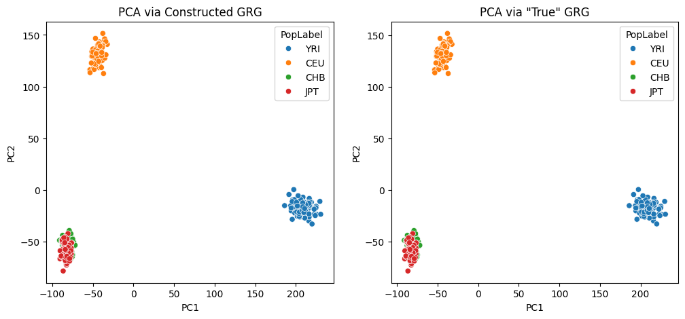

PCA Tutorial
============

This very simple tutorial shows you how to perform PCA with
`GRG <https://grgl.readthedocs.io/en/stable/concepts.html>`__ files. In
this example, we’re going to first simulate some data with populations
structure, and then compute the principal components and show that they
reflect that structure.

**What you’ll need:** \* Python dependencies “stdpopsim”, “msprime”,
“grapp”, “pandas”, “seaborn”:
``pip install stdpopsim msprime grapp pandas seaborn``

Simulate Data
-------------

We’re going to use `stdpopsim <>`__ and `msprime <>`__ to simulate the
data we need. The result of that simulation will be simulated Ancestral
Recombination Graphs (ARGs) in `tskit <>`__ format. Given such an ARG,
we have two options for converting it to GRG: \* We can convert the ARG
directly to a GRG by graph transformations. This is extremely fast, but
only works on simulated data. We sometimes refer to this as the “true
ARG” and the “true GRG”, since they did not need to be inferred from
data. \* A more realistic approach is to build a GRG from tabular data,
like ``.vcf.gz`` or
`IGD <https://picovcf.readthedocs.io/en/latest/igd_overview.html>`__.
For simulated data, the fastest way to do this is
``true ARG -> true GRG -> IGD``. We then generate an “constructed GRG”
from the IGD file.

We show both of these approaches below.

First, we need to actually simulate the data. This takes a couple of
minutes to run on my laptop.

.. code:: ipython3

    import stdpopsim
    
    # We will simulate 400 diploid individuals in total, equally spread across populations.
    individuals = 400
    i_per_pop = individuals // 4
    
    # Setup the options for stdpopsim
    species = stdpopsim.get_species("HomSap")
    samples = {"CEU": i_per_pop, "CHB": i_per_pop, "YRI": i_per_pop, "JPT": i_per_pop}
    contig = species.get_contig("chr22", genetic_map="HapMapII_GRCh38")
    engine = stdpopsim.get_engine("msprime")
    model = species.get_demographic_model("OutOfAfrica_4J17")
    
    # Simulate the data, which returns an ARG "ts" and then we also save that ARG to disk.
    ts = engine.simulate(model, contig, samples)
    ts.dump(f"stdpop.ooa4.chr22.trees")

.. parsed-literal::

    /home/ddehaas/Py3Env/lib/python3.10/site-packages/stdpopsim/engines.py:111: UserWarning: The demographic model has mutation rate 1.44e-08, but this simulation used the contig's mutation rate 1.29e-08. Diversity levels may be different than expected for this species. For details see documentation at https://popsim-consortium.github.io/stdpopsim-docs/stable/tutorial.html
      warnings.warn(

.. code:: ipython3

    list(ts.populations())

.. parsed-literal::

    [Population(id=0, metadata={'description': '1000 Genomes YRI (Yoruba)', 'id': 'YRI', 'name': 'YRI', 'sampling_time': 0}),
     Population(id=1, metadata={'description': '1000 Genomes CEU (Utah Residents (CEPH) with Northern and Western European Ancestry)', 'id': 'CEU', 'name': 'CEU', 'sampling_time': 0}),
     Population(id=2, metadata={'description': '1000 Genomes CHB (Han Chinese in Beijing, China)', 'id': 'CHB', 'name': 'CHB', 'sampling_time': 0}),
     Population(id=3, metadata={'description': '1000 Genomes JPT (Japanese in Tokyo, Japan)', 'id': 'JPT', 'name': 'JPT', 'sampling_time': 0})]

Now lets convert from the tree-sequence format (“ts”) to GRG. This
should be extremely fast.

.. code:: ipython3

    import pygrgl
    
    true_grg = pygrgl.grg_from_trees("stdpop.ooa4.chr22.trees")

One of the nice time-saving features of converting a simulated ARG to a
GRG is that we copy over two useful pieces of metadata: the times
associated with Mutations, and the Population labels associated with
samples. Below, we dump the population information (we’ll want it later)
and save it to a separate file as well (also for later).

.. code:: ipython3

    import json
    import pandas
    
    # Get the population labels in a form we want.
    pops = []
    for pop_id, pop_metadata in enumerate(true_grg.get_populations()):
        # If the tree-sequence stored the population as JSON, try to parse it.
        try:
            jpop = json.loads(pop_metadata)
            pops.append(jpop["name"])
        except:
            pops.append(pop_metadata)
    
    # GRG stores population labels per sample ndoe (haplotype), instead of per-individual. So we just want to save
    # tab-separated file, in sample-node order, of the labels.
    sample_pops = pandas.DataFrame({
        "Sample": range(true_grg.num_samples),
        "Population": [pops[true_grg.get_population_id(s)] for s in range(true_grg.num_samples)]
    })
    sample_pops.to_csv("pop_mapping.tsv", sep="\t", index=False)
    sample_pops

.. raw:: html

    

    
    <table border="1" class="dataframe">
      <thead>
        <tr style="text-align: right;">
          <th></th>
          <th>Sample</th>
          <th>Population</th>
        </tr>
      </thead>
      <tbody>
        <tr>
          <th>0</th>
          <td>0</td>
          <td>YRI</td>
        </tr>
        <tr>
          <th>1</th>
          <td>1</td>
          <td>YRI</td>
        </tr>
        <tr>
          <th>2</th>
          <td>2</td>
          <td>YRI</td>
        </tr>
        <tr>
          <th>3</th>
          <td>3</td>
          <td>YRI</td>
        </tr>
        <tr>
          <th>4</th>
          <td>4</td>
          <td>YRI</td>
        </tr>
        <tr>
          <th>...</th>
          <td>...</td>
          <td>...</td>
        </tr>
        <tr>
          <th>795</th>
          <td>795</td>
          <td>JPT</td>
        </tr>
        <tr>
          <th>796</th>
          <td>796</td>
          <td>JPT</td>
        </tr>
        <tr>
          <th>797</th>
          <td>797</td>
          <td>JPT</td>
        </tr>
        <tr>
          <th>798</th>
          <td>798</td>
          <td>JPT</td>
        </tr>
        <tr>
          <th>799</th>
          <td>799</td>
          <td>JPT</td>
        </tr>
      </tbody>
    </table>
    
800 rows × 2 columns

    

We can use this GRG directly if we want, but instead we’re going to
export it to IGD so that we can construct a GRG from tabular data, in a
more realistic way. This export process can be a bit slow (takes about
30-60 seconds on my laptop), because it is taking a very concise data
structure (GRG) and creating a much less concise sparse matrix format
(IGD) from it.

.. code:: ipython3

    from grapp.util.igd import export_igd
    
    export_igd(
        true_grg,
        "stdpop.ooa4.chr22.igd",
        jobs=4,
        verbose=True,
    )

.. parsed-literal::

    Using temporary directory /tmp/tmp1zgc_nhy.
    Splitting GRG into 8 parts..
    Converting GRG parts to IGD files...
    Merging 8 parts into single IGD stdpop.ooa4.chr22.igd...

Finally, lets create a GRG from the IGD. Again, if you had real data you
would just have a ``.vcf.gz`` or IGD file already, and this would be the
first step. The above was just to illustrate the various ways that
simulated data can be used. The grg construction below takes about 10
seconds on my laptop.

.. code:: bash

    %%bash
    
    # Now we're using that population map file that we exported above! This tells GRG how to label each sample
    # with it's population. The format of the argument is "filename:sample_field:pop_field", where the two field
    # names are the names we gave the columns in our tab-separated file.
    # The "sample" column must be string individual identifiers if the GRG has identifiers for individuals, otherwise
    # it must be the sample index (i.e., the order of that sample in all 2N samples).
    grg construct --population-ids "pop_mapping.tsv:Sample:Population" -j 4 stdpop.ooa4.chr22.igd -o stdpop.ooa4.chr22.grg

.. parsed-literal::

    Processing input file in 100 parts.
    Auto-calculating number of trees per part.
    Converting segments of input data to graphs
    100%|██████████| 100/100 [00:10<00:00,  9.36it/s]
    Merging...

.. parsed-literal::

    === GRG Statistics ===
    Nodes: 296524
    Edges: 2178293
    Samples: 800
    Mutations: 359119
    Ploidy: 2
    Phased: true
    Populations: 4
    Range of mutations: 15287934 - 50818401
    Specified range: 0 - 359628
    ======================
    Wrote simplified GRG with:
      Nodes: 296524
      Edges: 2178293
    Wrote GRG to stdpop.ooa4.chr22.grg

Performing PCA
--------------

Now that we have a GRG (well, two actually), lets load it, perform PCA,
and show that the results are identical between the two GRGs (it is the
same data, just converted into graphs in two different ways).

.. code:: ipython3

    grg = pygrgl.load_immutable_grg("stdpop.ooa4.chr22.grg")
    print(f"Populations: {grg.get_populations()}")
    print(f"Individuals: {grg.num_individuals}")
    print(f"Mutations (Variants): {grg.num_mutations}")

.. parsed-literal::

    Populations: ['YRI', 'CEU', 'CHB', 'JPT']
    Individuals: 400
    Mutations (Variants): 359119

.. code:: ipython3

    from grapp.linalg import PCs
    
    # First 2 PCs on the constructed GRG. This is very fast! A few seconds on my laptop.
    pca_df = PCs(grg, 2, unitvar=False)
    pca_df

.. raw:: html

    

    
    <table border="1" class="dataframe">
      <thead>
        <tr style="text-align: right;">
          <th></th>
          <th>PC1</th>
          <th>PC2</th>
        </tr>
        <tr>
          <th>Individual</th>
          <th></th>
          <th></th>
        </tr>
      </thead>
      <tbody>
        <tr>
          <th>0</th>
          <td>194.193031</td>
          <td>-20.152374</td>
        </tr>
        <tr>
          <th>1</th>
          <td>204.976810</td>
          <td>-14.595821</td>
        </tr>
        <tr>
          <th>2</th>
          <td>203.829988</td>
          <td>-19.090026</td>
        </tr>
        <tr>
          <th>3</th>
          <td>195.460814</td>
          <td>-28.349895</td>
        </tr>
        <tr>
          <th>4</th>
          <td>199.813934</td>
          <td>-14.681065</td>
        </tr>
        <tr>
          <th>...</th>
          <td>...</td>
          <td>...</td>
        </tr>
        <tr>
          <th>395</th>
          <td>-77.386700</td>
          <td>-65.259156</td>
        </tr>
        <tr>
          <th>396</th>
          <td>-83.253270</td>
          <td>-64.976000</td>
        </tr>
        <tr>
          <th>397</th>
          <td>-81.988488</td>
          <td>-63.991201</td>
        </tr>
        <tr>
          <th>398</th>
          <td>-84.046194</td>
          <td>-57.446683</td>
        </tr>
        <tr>
          <th>399</th>
          <td>-78.691830</td>
          <td>-66.300048</td>
        </tr>
      </tbody>
    </table>
    
400 rows × 2 columns

    

.. code:: ipython3

    # First 2 PCs on the "true" GRG (converted from ARG). This is a bit slower - about 20-30 seconds on my laptop.
    # This highlights something interesting: the constructed GRG is created for speed and compression, and is the one that 
    # is used on real data. The "true" GRG still contains a lot of the coalescence structure from the ARG, which may be
    # less performant for linear algebra.
    true_pca_df = PCs(true_grg, 2, unitvar=False)
    true_pca_df

.. raw:: html

    

    
    <table border="1" class="dataframe">
      <thead>
        <tr style="text-align: right;">
          <th></th>
          <th>PC1</th>
          <th>PC2</th>
        </tr>
        <tr>
          <th>Individual</th>
          <th></th>
          <th></th>
        </tr>
      </thead>
      <tbody>
        <tr>
          <th>0</th>
          <td>194.275947</td>
          <td>-20.147350</td>
        </tr>
        <tr>
          <th>1</th>
          <td>205.092217</td>
          <td>-14.601785</td>
        </tr>
        <tr>
          <th>2</th>
          <td>203.893973</td>
          <td>-19.053393</td>
        </tr>
        <tr>
          <th>3</th>
          <td>195.542736</td>
          <td>-28.301942</td>
        </tr>
        <tr>
          <th>4</th>
          <td>199.833256</td>
          <td>-14.653547</td>
        </tr>
        <tr>
          <th>...</th>
          <td>...</td>
          <td>...</td>
        </tr>
        <tr>
          <th>395</th>
          <td>-77.387497</td>
          <td>-65.264807</td>
        </tr>
        <tr>
          <th>396</th>
          <td>-83.308376</td>
          <td>-65.039118</td>
        </tr>
        <tr>
          <th>397</th>
          <td>-82.017372</td>
          <td>-64.053615</td>
        </tr>
        <tr>
          <th>398</th>
          <td>-84.047321</td>
          <td>-57.475539</td>
        </tr>
        <tr>
          <th>399</th>
          <td>-78.697767</td>
          <td>-66.327669</td>
        </tr>
      </tbody>
    </table>
    
400 rows × 2 columns

    

Visual inspection of the dataframes above indicates that the two GRGs
produce nearly identical PCA results. Now we’ll plot all the individuals
in the dataset, for both sets of PCs, where the X-axis is PC1 and the
Y-axis is PC2. The colors of the dots correspond to the original
population identifiers for the individuals, as defined by the original
simulation we did.

.. code:: ipython3

    import matplotlib.pyplot as plt
    import seaborn
    
    # First, lets map each individual to population label and put that in a dataframe.
    labels = grg.get_populations()
    label_df = pandas.DataFrame({"PopLabel": [labels[grg.get_population_id(grg.ploidy * i)] for i in range(grg.num_individuals)]})
    
    constructed_df = pandas.concat([pca_df, label_df], axis=1)
    true_df = pandas.concat([true_pca_df, label_df], axis=1)
    
    f, axs = plt.subplots(1, 2, figsize=(12, 5))
    seaborn.scatterplot(data=constructed_df, x="PC1", y="PC2", hue="PopLabel", ax=axs[0])
    axs[0].set_title("PCA via Constructed GRG")
    seaborn.scatterplot(data=true_df, x="PC1", y="PC2", hue="PopLabel", ax=axs[1])
    axs[1].set_title("PCA via \"True\" GRG")

.. parsed-literal::

    Text(0.5, 1.0, 'PCA via "True" GRG')

Depending on some non-deterministic behavior in the underlying eigen
solve, you may notice that slight numerical differences result in the
plots above being identical, except for a rotation about one of the
axes. The PCs are still equivalent in this case!

You can increase the number of PCs to compute somewhat arbitrarily, but
we don’t recommend computing them all: we’re using an `iterative eigen
decomposition algorithm via
scipy <https://docs.scipy.org/doc/scipy/reference/generated/scipy.sparse.linalg.eigs.html#scipy.sparse.linalg.eigs>`__
and it will not perform well when asking for all eigen values/vectors.

You can also try the ``use_pro_pca=True`` options when calling
``PCs()``, which will use the algorithm described in the paper `Scalable
probabilistic PCA for large-scale genetic variation
data <https://pubmed.ncbi.nlm.nih.gov/32469896/>`__ by Agrawal, et. al.

Related Topics
--------------

-  See `LinearOperators <LinearOperators.html>`__ for information on the
   `scipy <https://scipy.org/>`__ linear algebra integration that
   underlies this PCA approach.
-  Documentation links:

   -  `grapp.linalg <https://grapp.readthedocs.io/en/latest/grapp.html#linear-algebra>`__:
      Python APIs for Linear Algebra on GRG
