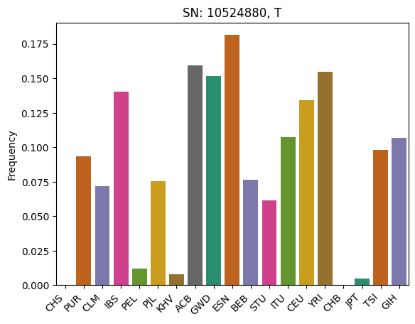

Working with Real Data
======================

In this tutorial we’re going to download publicly available `1,000
Genomes Project <https://www.internationalgenome.org/>`__ data and
examine it with GRG. The goal is just to illustrate the ease with which
you can work with such datasets. We also illustrate how to include
population information in GRG for a real dataset.

**What is demonstrated:**

-  Building a GRG from real data, including population information
-  Using GRG matrix multiplication to calculate population-specific
   allele frequencies
-  Using `grapp <https://github.com/aprilweilab/grapp>`__ to filter
   information out of a GRG

**What you’ll need:**

-  Python dependencies “grapp”, “seaborn”: ``pip install grapp seaborn``
-  Command line tools “wget”, “tabix”: ``sudo apt install wget tabix``
   (or your system’s equivalent)

First, download the data. This can take 10-15 minutes, depending on your
internet connection (the file is roughly 425MB)

.. code:: bash

    %%bash
    
    REMOTE_FILE="https://ftp.1000genomes.ebi.ac.uk/vol1/ftp/data_collections/1000G_2504_high_coverage/working/20220422_3202_phased_SNV_INDEL_SV/1kGP_high_coverage_Illumina.chr22.filtered.SNV_INDEL_SV_phased_panel.vcf.gz"
    
    if [[ ! -e kgp.chr22.vcf.gz ]]; then
        wget ${REMOTE_FILE} --progress=dot:mega -O kgp.chr22.vcf.gz
        tabix kgp.chr22.vcf.gz
    fi
    
    echo "Size of input file:"
    du -hs kgp.chr22.vcf.gz

.. parsed-literal::

    Size of input file:
    426M	kgp.chr22.vcf.gz

Build the GRG
-------------

GRG can be built from either `IGD <IGDToGRG.html>`__ or directly from
``.vcf.gz``. IGD is generally smaller and faster than VCF, so if you
want to manipulate this data repeatedly (outside of GRG), then convert
to IGD first. Otherwise, you can just do a one-time conversion from
``.vcf.gz`` to GRG.

We’ll just convert from the VCF file. Before we do that, let’s prepare
information that maps each sample in the dataset to a population label,
based on metadata provided from the 1,000 Genomes Project.

For population information, GRG needs a tab-separated file with a
header. We construct the GRG with the filename and the names of two
columns: the column containing the sample identifier (individual ID),
and the column containing the population label.

1,000 Genomes data has both “population” and “super-population” labels
in `their data
browser <https://www.internationalgenome.org/data-portal/sample>`__.
We’ll use the “population” labels since they are easier to download from
the FTP site.

.. code:: bash

    %%bash
    
    if [[ ! -e 1000G_2504_high_coverage.sequence.index ]]; then
      # Two files: one for the original 2504 samples, and one for the additional 698 samples.
      wget https://ftp.1000genomes.ebi.ac.uk/vol1/ftp/data_collections/1000G_2504_high_coverage/1000G_2504_high_coverage.sequence.index --progress=dot:mega
      wget https://ftp.1000genomes.ebi.ac.uk/vol1/ftp/data_collections/1000G_2504_high_coverage/1000G_698_related_high_coverage.sequence.index --progress=dot:mega
    fi
    
    # Combine the two files into a single metadata file
    cat 1000G_2504_high_coverage.sequence.index 1000G_698_related_high_coverage.sequence.index > kgp.combined_metadata.tsv
    
    # Show the format
    head -n 25 kgp.combined_metadata.tsv

.. parsed-literal::

    --2026-02-06 12:31:56--  https://ftp.1000genomes.ebi.ac.uk/vol1/ftp/data_collections/1000G_2504_high_coverage/1000G_2504_high_coverage.sequence.index
    Resolving ftp.1000genomes.ebi.ac.uk (ftp.1000genomes.ebi.ac.uk)... 193.62.193.167
    Connecting to ftp.1000genomes.ebi.ac.uk (ftp.1000genomes.ebi.ac.uk)|193.62.193.167|:443... connected.
    HTTP request sent, awaiting response... 200 OK
    Length: 982480 (959K)
    Saving to: ‘1000G_2504_high_coverage.sequence.index’
    
         0K ........ ......                                      100% 1.70M=0.5s
    
    2026-02-06 12:31:57 (1.70 MB/s) - ‘1000G_2504_high_coverage.sequence.index’ saved [982480/982480]
    
    --2026-02-06 12:31:57--  https://ftp.1000genomes.ebi.ac.uk/vol1/ftp/data_collections/1000G_2504_high_coverage/1000G_698_related_high_coverage.sequence.index
    Resolving ftp.1000genomes.ebi.ac.uk (ftp.1000genomes.ebi.ac.uk)... 193.62.193.167
    Connecting to ftp.1000genomes.ebi.ac.uk (ftp.1000genomes.ebi.ac.uk)|193.62.193.167|:443... connected.
    HTTP request sent, awaiting response... 200 OK
    Length: 294388 (287K)
    Saving to: ‘1000G_698_related_high_coverage.sequence.index’
    
         0K ....                                                 100%  801K=0.4s
    
    2026-02-06 12:31:58 (801 KB/s) - ‘1000G_698_related_high_coverage.sequence.index’ saved [294388/294388]
    

.. parsed-literal::

    ##FileDate=20190503
    ##ENA_FILE_PATH=path to ENA file on ENA ftp site
    ##MD5=md5sum of file
    ##RUN_ID=SRA/ERA run accession
    ##STUDY_ID=SRA/ERA study accession
    ##STUDY_NAME=Name of study
    ##CENTER_NAME=Submission centre name
    ##SUBMISSION_ID=SRA/ERA submission accession
    ##SUBMISSION_DATE=Date sequence submitted, YYYY-MM-DD
    ##SAMPLE_ID=SRA/ERA sample accession
    ##SAMPLE_NAME=Sample name
    ##POPULATION=Sample population. Further information may be available with the data collection.
    ##EXPERIMENT_ID=Experiment accession
    ##INSTRUMENT_PLATFORM=Type of sequencing machine
    ##INSTRUMENT_MODEL=Model of sequencing machine
    ##LIBRARY_NAME=Library name
    ##RUN_NAME=Name of machine run
    ##INSERT_SIZE=Submitter specifed insert size/paired nominal length
    ##LIBRARY_LAYOUT=Library layout, this can be either PAIRED or SINGLE
    ##PAIRED_FASTQ=Name of mate pair file if exists (Runs with failed mates will have a library layout of PAIRED but no paired fastq file)
    ##READ_COUNT=Read count for the file
    ##BASE_COUNT=Basepair count for the file
    ##ANALYSIS_GROUP=Analysis group is used to identify groups, or sets, of data. Further information may be available with the data collection.
    #ENA_FILE_PATH	MD5SUM	RUN_ID	STUDY_ID	STUDY_NAME	CENTER_NAME	SUBMISSION_ID	SUBMISSION_DATE	SAMPLE_ID	SAMPLE_NAME	POPULATION	EXPERIMENT_ID	INSTRUMENT_PLATFORM	INSTRUMENT_MODEL	LIBRARY_NAME	RUN_NAME	INSERT_SIZE	LIBRARY_LAYOUT	PAIRED_FASTQ	READ_COUNT	BASE_COUNT	ANALYSIS_GROUP
    ftp://ftp.sra.ebi.ac.uk/vol1/run/ERR323/ERR3239480/NA12718.final.cram	923ca8ff7d4cd65fddd28e855e5f173d	ERR3239480	ERP114329	30X whole genome sequencing coverage of the 2504 Phase 3 1000 Genome samples.	NYGC	ERA1783081	2019-03-22 00:00	SRS000632	NA12718	CEU	ERX3266855	ILLUMINA	Illumina NovaSeq 6000	NA12718	ena-RUN-NYGC-22-03-2019-12:30:23:667-205	450	PAIRED		753247448	112987117200	high_cov

The file is a bit messy for GRG to try to use as is (especially since we
concatenated the two files without removing the headers). So below we
use some Python code to make it cleaner.

.. code:: ipython3

    # List of (sample, population) pairs that we will output for use with GRG
    sample_pops = []
    with open("kgp.combined_metadata.tsv") as f:
        for line in f:
            line = line.rstrip("\n").rstrip("\r")
            # Skip comments
            if line.startswith("#"):
                continue
            data = line.split("\t")
            sample_pops.append( (data[9].strip(), data[10].strip()) )
    
    with open("kgp.popmap.tsv", "w") as fout:
        fout.write("SAMPLE\tPOPULATION\n")  # Header
        fout.write("\n".join(["\t".join(s) for s in sample_pops]))

Now we can use the ``--population-ids`` flag to ``grg construct`` to
incorporate this information in the GRG. This is mostly a convenience,
we could just create the GRG without doing any of this population
mapping.

The argument ``"kgp.popmap.tsv:SAMPLE:POPULATION"`` can be interpreted
as
``<filename>:<column with sample IDs>:<column with population labels>``.

Building this GRG takes about 4 minutes (with 4 threads) on my laptop.

.. code:: bash

    %%bash
    
    if [[ ! -e kgp.chr22.grg ]]; then
        grg construct -j 4 --population-ids "kgp.popmap.tsv:SAMPLE:POPULATION" kgp.chr22.vcf.gz -o kgp.chr22.grg
    fi

.. parsed-literal::

    Will not count variants in VCF files (too slow)
    Could not count number of variants in kgp.chr22.vcf.gz. Using the default of 100 (use --parts to override).
    Processing input file in 100 parts.
    Auto-calculating number of trees per part.
    Converting segments of input data to graphs
    100%|██████████| 100/100 [04:54<00:00,  2.94s/it]
    Merging...

.. parsed-literal::

    === GRG Statistics ===
    Nodes: 2460735
    Edges: 21442726
    Samples: 6404
    Mutations: 1066557
    Ploidy: 2
    Phased: true
    Populations: 26
    Range of mutations: 10519265 - 50808015
    Specified range: 0 - 50818469
    ======================
    Wrote simplified GRG with:
      Nodes: 2460735
      Edges: 21442726
    Wrote GRG to kgp.chr22.grg

Examine GRG and allele frequencies
----------------------------------

Now we can load the GRG and examine the information in it. As an
example, lets compute the allele frequencies for just a few of the
populations that have a large number of samples (more than 200
haplotypes) in the dataset. We’ll compute these per-population and then
display them.

For more complex computations on GRG, see
`LinearOperators <LinearOperators.html>`__, `PCA <PCA.html>`__, or
`GWAS <GWAS.html>`__.

.. code:: ipython3

    import pygrgl
    
    grg = pygrgl.load_immutable_grg("kgp.chr22.grg", load_up_edges=False)

Something really simple we can do is look at the individual identifiers
for each individual in the GRG. Not all GRGs have individual IDs: only
if the original data had the IDs. Here we just show the first and last
individual.

.. code:: ipython3

    print(f"First: {grg.get_individual_id(0)}")
    print(f"Last: {grg.get_individual_id(grg.num_individuals - 1)}")

.. parsed-literal::

    First: HG00096
    Last: NA21144

We want to use `GRG matrix
multiplication <https://grgl.readthedocs.io/en/stable/python_api.html#pygrgl.matmul>`__
later on to compute the per-population allele frequencies. So we will:
\* Find all :math:`K` populations with at least 200 haplotypes \* Create
a :math:`K \times 2N` matrix (where :math:`N` is the number of diploid
individuals) :math:`A` that represents our labeled samples \* If
haplotype sample :math:`i` has population label :math:`j`, then
:math:`A_{j, i} = 1` \* Given our (haploid) genotype matrix :math:`X`
(as represented by the GRG), we can get the population specific allele
counts via :math:`A \times X`

.. code:: ipython3

    from collections import defaultdict
    import numpy
    
    # Find populations with at least 100 haplotypes
    labels = grg.get_populations()
    pop_mapping = defaultdict(list)
    for sample in range(grg.num_samples):
        pop_label = labels[grg.get_population_id(sample)]
        pop_mapping[pop_label].append(sample)
    
    # Get labels and samples for populations exceeding our threshold
    K_pops = list(filter(lambda item: len(item[1]) >= 200, pop_mapping.items()))
    
    # Create the matrix
    K = len(K_pops)
    A = numpy.zeros( (K, grg.num_samples), dtype=numpy.int32 )
    
    # Populate the matrix
    for j, (pop_label, sample_list) in enumerate(K_pops):
        print(f"{pop_label} has {len(sample_list)} haplotypes")
        A[j, sample_list] = 1

.. parsed-literal::

    CHS has 326 haplotypes
    PUR has 278 haplotypes
    CLM has 264 haplotypes
    IBS has 314 haplotypes
    PEL has 244 haplotypes
    PJL has 292 haplotypes
    KHV has 244 haplotypes
    ACB has 232 haplotypes
    GWD has 356 haplotypes
    ESN has 298 haplotypes
    BEB has 262 haplotypes
    STU has 228 haplotypes
    ITU has 214 haplotypes
    CEU has 358 haplotypes
    YRI has 356 haplotypes
    CHB has 206 haplotypes
    JPT has 208 haplotypes
    TSI has 214 haplotypes
    GIH has 206 haplotypes

Now we compute the allele counts. The frequency will just be dividing
the counts by :math:`N_j`, the number of haploptypes in each population.

We’re going to use
`pygrgl.matmul <https://grgl.readthedocs.io/en/stable/python_api.html#pygrgl.matmul>`__
to do the work for us. *Notice*: we could also do our own graph
traversal to compute these values, but ``matmul()`` is much faster (it
does the traversal with optimized C++ code).

.. code:: ipython3

    N = [len(sample_list) for pop_label, sample_list in K_pops]
    
    # The "direction" tells us whether we are summing values from the leaves-to-roots (UP) or roots-to-leaves (DOWN).
    # These are equivalent to multiplication against X or X^T.
    # Here we have an input that is in terms of _samples_, which are the leaves, so we need to start at the samples
    # and sum the values until we reach the mutations (UP).
    allele_counts = pygrgl.matmul(grg, A, pygrgl.TraversalDirection.UP)
    
    frequencies = allele_counts / numpy.array([N]).T

We’ll pick the column from the data that has an above average sum and
plot it.

.. code:: ipython3

    import seaborn
    import pandas
    
    # Sum by column
    total_snp_freqs = numpy.sum(frequencies[:, ], axis=0)
    
    # Find the maximum column sum values
    avg = numpy.mean(total_snp_freqs)
    
    # Get the first index that has the max value
    snp_index = numpy.where(total_snp_freqs >= avg)[0][0]
    mutation = grg.get_mutation_by_id(snp_index)             # Get the Mutation object
    
    # Now plot the frequencies at that index
    df = pandas.DataFrame({
        "SNP": [snp_index] * K,
        "Frequency": frequencies[:, snp_index],
        "Pop Label": [label for label, smp in K_pops],
    })
    ax = seaborn.barplot(data=df, x="Pop Label", y="Frequency", hue="Pop Label", palette="Dark2")
    ax.set_title(f"SN: {mutation.position}, {mutation.allele}")
    ax.set_xticks(ax.get_xticks())
    ax.set_xticklabels(ax.get_xticklabels(), rotation=45, ha='right')
    ax.set_xlabel(None)

.. parsed-literal::

    Text(0.5, 0, '')

Filter the GRG
--------------

Now we illustrate the types of filtering that are available. At the
basic level GRG can be filtered in two ways: 1. By removing a subset of
samples. 2. By removing a subset of mutations. If you want to do both,
then you need to do it sequentially: e.g., first remove mutations and
then samples (or vise versa).

The core library for filtering is
`pygrgl.save_subset <https://grgl.readthedocs.io/en/stable/python_api.html#pygrgl.save_subset>`__,
which is very flexible and useful for calling from Python code.

However, here we are going to demonstrate the filtering available in the
`grapp command
line <https://github.com/aprilweilab/grapp/blob/main/README.md>`__,
which implements a bunch of common filtering scenarios for you (and
calls ``save_subset()`` under the hood).

Filter by sample
----------------

First, we’ll filter the GRG down to just the samples that we used in our
plot above. We’ll use ``grapp filter --hap-samples <filename>`` to do
this.

In our case, we know that we are actually filtering by individuals; even
though the population information is stored at the haplotype level, the
way we generated the GRG means that we will only have pairs of
haplotypes that belond to individuals. In other words: the
haplotype-to-diploid mapping is *maintained* by this filter.

.. code:: ipython3

    # Save our samples to a list
    all_samples = []
    for pop_label, sample_list in K_pops:
        all_samples.extend(sample_list)
    
    with open("haplotypes.txt", "w") as fout:
        fout.write("\n".join(map(str, all_samples)))
    
    print(f"Wrote {len(all_samples)} samples to haplotypes.txt")

.. parsed-literal::

    Wrote 5100 samples to haplotypes.txt

.. code:: bash

    %%bash
    # Filter the GRG. This should be pretty fast (seconds).
    grapp filter --hap-samples haplotypes.txt kgp.chr22.grg kgp.chr22.hap_filtered.grg
    
    grg process stats kgp.chr22.hap_filtered.grg

.. parsed-literal::

    Keeping 5100 haplotypes

.. parsed-literal::

    Construction took 158 ms

.. parsed-literal::

    === GRG Statistics ===
    Nodes: 2219044
    Edges: 18011864
    Samples: 5100
    Mutations: 1066557
    Ploidy: 2
    Phased: true
    Populations: 26
    Range of mutations: 10519265 - 50808015
    Specified range: 0 - 0
    ======================

Notice that ``Ploidy: 2`` above was retained: this is because we
filtered the haplotypes in a way that kept their pairing between diploid
and haplotype. If we filter a GRG by haplotype and do not maintain this
(e.g., if we keep the odd-numbered haplotypes only) then the GRG will
become ``Ploidy: 1``.

Another way to do the above filtering is to just specify what
populations we want! We can use ``grapp filter --populations`` for that.
For both of these commands, you can either specify a filename or a
comma-separated list of items to keep.

.. code:: bash

    %%bash
    # Filter the GRG. This should be pretty fast (seconds).
    grapp filter --populations "CHS,PUR,CLM,IBS,PEL,PJL,KHV,ACB,GWD,ESN,BEB,STU,ITU,CEU,YRI,CHB,JPT,TSI,GIH" kgp.chr22.grg kgp.chr22.pop_filtered.grg
    
    grg process stats kgp.chr22.pop_filtered.grg

.. parsed-literal::

    Keeping 5100 haplotypes

.. parsed-literal::

    Construction took 144 ms

.. parsed-literal::

    === GRG Statistics ===
    Nodes: 2219044
    Edges: 18011864
    Samples: 5100
    Mutations: 1066557
    Ploidy: 2
    Phased: true
    Populations: 26
    Range of mutations: 10519265 - 50808015
    Specified range: 0 - 0
    ======================

Filter by Mutation
------------------

There are a bunch of options for filtering by Mutations.

::

   mutation filters:
     -r RANGE, --range RANGE
                           Keep only the variants within the given range, in base pairs. Example: "lower-upper", where both are integers and lower is inclusive, upper is exclusive.
     -c MIN_AC, --min-ac MIN_AC
                           Minimum allele count to keep. All Mutations with count below this value will be dropped
     -C MAX_AC, --max-ac MAX_AC
                           Maximum allele count to keep. All Mutations with count above this value will be dropped
     -q MIN_AF, --min-af MIN_AF
                           Minimum allele frequency to keep. All Mutations with frequency below this value will be dropped
     -Q MAX_AF, --max-af MAX_AF
                           Maximum allele frequency to keep. All Mutations with frequency above this value will be dropped

These filters can be combined together in a single command. Here we’ll
illustrate keeping only mutations with the range ``20000000-25000000``
that have an allele count of at least 20.

.. code:: bash

    %%bash
    # Filter the GRG. This should be pretty fast (seconds).
    grapp filter -r "20000000-25000000" -c 20 kgp.chr22.pop_filtered.grg kgp.chr22.mut_filtered.grg
    
    grg process stats kgp.chr22.mut_filtered.grg

.. parsed-literal::

    Construction took 10 ms

.. parsed-literal::

    === GRG Statistics ===
    Nodes: 274295
    Edges: 2476134
    Samples: 5100
    Mutations: 47945
    Ploidy: 2
    Phased: true
    Populations: 26
    Range of mutations: 20000241 - 24999768
    Specified range: 20000000 - 25000000
    ======================

.. code:: ipython3

    # Lets load the graph and check the minimum allele counts!
    from grapp.util.simple import allele_counts
    
    smaller_grg = pygrgl.load_immutable_grg("kgp.chr22.mut_filtered.grg")
    mut_counts = allele_counts(smaller_grg)
    
    print(f"Minimum allele count: {numpy.min(mut_counts)}")

.. parsed-literal::

    Minimum allele count: 20

Related Topics
--------------

-  More specific applications for GRG to real data are
   `GWAS <GWAS.html>`__, `PCA <PCA.html>`__.
-  Documentation links:

   -  `pygrgl <https://grgl.readthedocs.io/en/stable/python_api.html>`__:
      The full Python API for GRGL, the low-level operations you can
      perform on a GRG.
   -  `grapp.util <https://grapp.readthedocs.io/en/latest/grapp.html#filtering-export-etc>`__:
      The Python APIs for utility functions, like counting alleles,
      filtering, etc.
